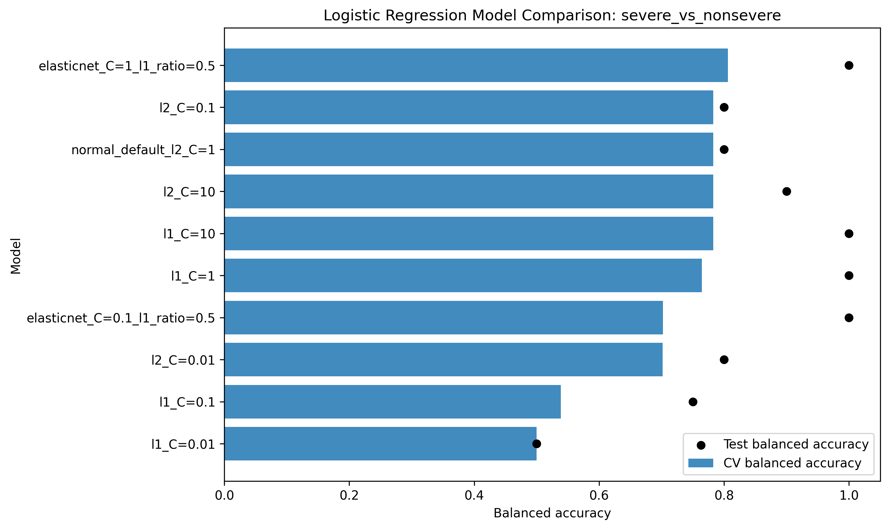
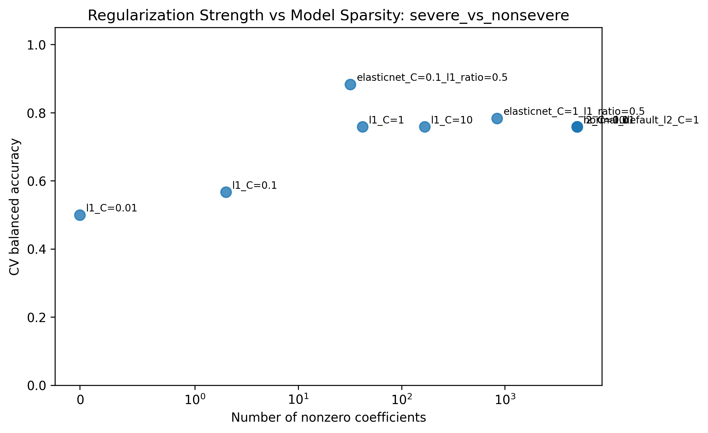
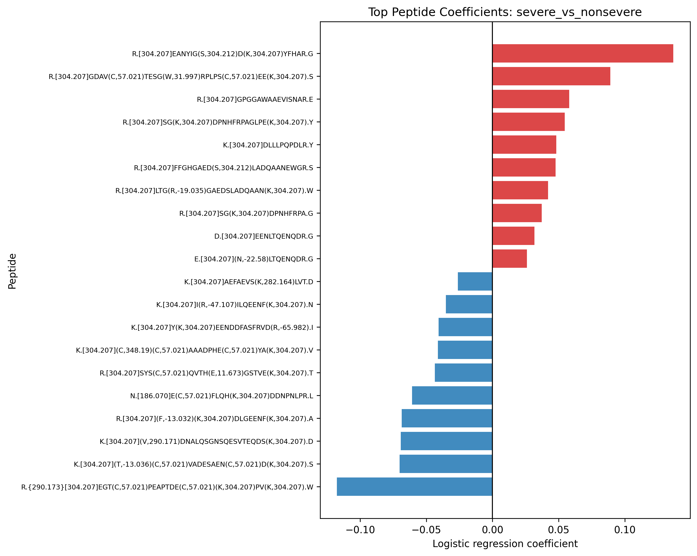

# CSE 291B COVID-19 Serum Proteomics Project

This project builds machine learning models to classify COVID-19 patient condition from serum proteomics peptide-variant intensity data. We focus on the following binary classification tasks:

- Healthy vs. infected
- Symptomatic non-COVID vs. COVID
- Severe COVID-19 vs. non-severe COVID-19

## Dataset

The data comes from the COVID-19 Patient Sera MAESTRO results table:

```text
data/ProteoSAFe-MAESTRO-d6178bdd-identified_variants_merged_protein_regions/
MAESTRO-d6178bdd-identified_variants_merged_protein_regions-main.tsv
```

The original TSV contains peptide annotations, protein mappings, unmodified-sequence intensities, and peptide-variant intensities. For modeling, we use columns ending in:

```text
_intensity_for_peptide_variant
```

Each of these intensity columns encodes the patient condition and sample ID in its name. For example:

```text
_dyn_#Severe-COVID-19.XG26.Severe-COVID-19..XG26.1_intensity_for_peptide_variant
```

This corresponds to condition `Severe-COVID-19` and sample ID `XG26`.

## Project Structure

```text
preprocessing.ipynb
baseline.ipynb
data/processed/
```

- `preprocessing.ipynb`: loads the raw TSV, extracts peptide-variant intensities, handles missingness, creates task-specific labels, and saves train/test matrices.
- `baseline.ipynb`: trains baseline logistic regression models with L2, L1, and Elastic Net regularization for all three tasks.
- `data/processed/`: contains shared feature metadata plus one subfolder per task with processed matrices, labels, metadata, result tables, coefficient tables, and generated plots.

## Preprocessing

This dataset has a small number of samples and a very high-dimensional peptide feature space. The preprocessing therefore focuses on making the matrix model-ready while reducing unreliable sparse features.

Implementation workflow:

1. Load the TSV with pandas.
2. Keep `Peptide` plus all `_intensity_for_peptide_variant` columns.
3. Parse condition and sample ID from intensity column names.
4. Remove non-patient controls: `Empty` and `Norm`.
5. Convert zero intensities to `NaN` because zeros in mass spectrometry usually indicate non-detection rather than true abundance.
6. Remove peptides with more than 50% missingness across patient samples.
7. Impute remaining missing values as `0`, representing absence/non-detection.
8. Apply `log1p` transformation to reduce intensity skew.
9. Transpose the matrix so rows are samples and columns are peptide features.
10. Define the three binary classification tasks.
11. Encode labels separately for each task:

| Task | Label 0 | Label 1 |
| --- | --- | --- |
| `healthy_vs_infected` | Healthy | Infected: non-severe COVID-19, severe COVID-19, symptomatic non-COVID |
| `symptomatic_non_covid_vs_covid` | Symptomatic-non-COVID-19 | COVID-19: non-severe COVID-19, severe COVID-19 |
| `severe_vs_nonsevere` | Non-severe-COVID-19 | Severe-COVID-19 |


Final processed data:

| Task | Train samples | Test samples | Features | Train label counts | Test label counts |
| --- | ---: | ---: | ---: | --- | --- |
| `healthy_vs_infected` | 72 | 18 | 35,882 | 54 infected, 18 healthy | 14 infected, 4 healthy |
| `symptomatic_non_covid_vs_covid` | 54 | 14 | 35,882 | 34 COVID-19, 20 symptomatic non-COVID | 9 COVID-19, 5 symptomatic non-COVID |
| `severe_vs_nonsevere` | 34 | 9 | 35,882 | 20 non-severe, 14 severe | 5 non-severe, 4 severe |

The 50% missingness threshold is used as a practical reliability filter: peptides missing in most samples are more likely to be unstable, dominated by non-detection, and sensitive to imputation. This threshold keeps peptides observed in at least half of the patient cohort while still retaining a large feature set.

## Baseline Model - Random Choice

We use a random-choice classifier as the baseline for this dataset. It provides a simple chance-level reference for the three binary tasks, which makes it easier to judge how much signal the learned models are capturing.

The comparison models evaluate:

- Standard L2 logistic regression with `C=1`
- L2 regularization with multiple `C` values
- L1 regularization with multiple `C` values
- Elastic Net regularization with `l1_ratio=0.5`

To further control overfitting and improve runtime, each model uses a pipeline with:

- `SelectKBest(f_classif, k=5000)` for train-fold feature preselection
- Logistic regression classifier
- 3-fold stratified cross-validation
- Held-out test evaluation

The value `k=5000` is a practical cap: it reduces the feature space from 35,882 peptides to a computationally manageable subset while still retaining a broad set of candidate peptide markers. It should be treated as a baseline hyperparameter rather than a biologically fixed threshold.

Metrics include balanced accuracy, F1 score, ROC-AUC, precision, recall, and number of nonzero coefficients.

## Logistic Regression Results

Random-choice baseline results are saved alongside the model comparison tables so the baseline reference stays explicit in the reported outputs.

Results are saved in:

```text
data/processed/logistic_regression_baseline_results_all_tasks.csv
data/processed/logistic_regression_best_models_by_task.csv
data/processed/<task>/logistic_regression_baseline_results.csv
```

Best model by cross-validation balanced accuracy for each task:

| Task | Best model | CV balanced accuracy | CV F1 | Test balanced accuracy | Test F1 | Test ROC-AUC | Nonzero coefficients |
| --- | --- | ---: | ---: | ---: | ---: | ---: | ---: |
| `healthy_vs_infected` | `l1_C=1` | 0.889 | 0.921 | 1.000 | 1.000 | 1.000 | 67 |
| `symptomatic_non_covid_vs_covid` | `l1_C=10` | 0.843 | 0.885 | 1.000 | 1.000 | 1.000 | 252 |
| `severe_vs_nonsevere` | `elasticnet_C=1_l1_ratio=0.5` | 0.806 | 0.781 | 1.000 | 1.000 | 1.000 | 840 |

Several models achieve perfect held-out test scores, but the task-specific test sets are small. These test results should therefore be interpreted as preliminary rather than strong evidence of generalization.

## Updated Comparison Table

The following table summarizes the performance metrics for all models across the three tasks:

| Task                          | Model                 | Accuracy | Balanced Accuracy | Precision | Recall | F1 Score | ROC AUC | AUPRC |
|-------------------------------|-----------------------|----------|-------------------|-----------|--------|----------|---------|-------|
| Healthy vs Infected           | Logistic Regression   | 1.00     | 1.00              | 1.00      | 1.00   | 1.00     | 1.00    | 1.00  |
| Healthy vs Infected           | Random Forest         | 0.89     | 0.75              | 0.88      | 1.00   | 0.93     | 1.00    | 1.00  |
| Healthy vs Infected           | SVM                   | 0.78     | 0.86              | 1.00      | 0.71   | 0.83     | 0.98    | 1.00  |
| Healthy vs Infected           | XGBoost (Nonlinear)   | 0.94     | 0.88              | 0.93      | 1.00   | 0.97     | 1.00    | 1.00  |
| Healthy vs Infected           | Random Baseline       | 0.64     | 0.50              | 0.78      | 0.75   | 0.76     | 0.50    | 0.76  |
| Severe vs Non-severe          | Logistic Regression   | 1.00     | 1.00              | 1.00      | 1.00   | 1.00     | 1.00    | 1.00  |
| Severe vs Non-severe          | Random Forest         | 0.44     | 0.42              | 0.33      | 0.25   | 0.29     | 0.55    | 0.64  |
| Severe vs Non-severe          | SVM                   | 0.78     | 0.80              | 0.67      | 1.00   | 0.80     | 1.00    | 1.00  |
| Severe vs Non-severe          | XGBoost (Nonlinear)   | 0.78     | 0.75              | 1.00      | 0.50   | 0.67     | 0.80    | 0.83  |
| Severe vs Non-severe          | Random Baseline       | 0.51     | 0.50              | 0.44      | 0.41   | 0.41     | 0.50    | 0.42  |
| Symptomatic Non-COVID vs COVID| Logistic Regression   | 1.00     | 1.00              | 1.00      | 1.00   | 1.00     | 1.00    | 1.00  |
| Symptomatic Non-COVID vs COVID| Random Forest         | 0.64     | 0.50              | 0.64      | 1.00   | 0.78     | 0.96    | 0.98  |
| Symptomatic Non-COVID vs COVID| SVM                   | 0.86     | 0.89              | 1.00      | 0.78   | 0.88     | 0.93    | 0.97  |
| Symptomatic Non-COVID vs COVID| XGBoost (Nonlinear)   | 1.00     | 1.00              | 1.00      | 1.00   | 1.00     | 1.00    | 1.00  |
| Symptomatic Non-COVID vs COVID| Random Baseline       | 0.54     | 0.50              | 0.64      | 0.63   | 0.63     | 0.50    | 0.63  |

## Overall Accuracy Comparison

The following table provides an overall accuracy comparison across all models:

| Model               | Overall Accuracy |
|---------------------|------------------|
| Logistic Regression | 1.00            |
| Random Forest       | 0.66            |
| SVM                 | 0.80            |
| XGBoost (Nonlinear) | 0.91            |
| Random Baseline     | 0.56            |

## Result Plots

### Model Comparison



The blue bars show mean 3-fold cross-validation balanced accuracy, while the black points show held-out test balanced accuracy. Each task subfolder contains its own version of this plot.

### Sparsity vs. Accuracy



This plot shows how regularization changes model sparsity. L2 models retain all 5000 selected features, while L1 and Elastic Net shrink many coefficients to zero. Strong L1 regularization can underfit: `l1_C=0.01` removes all coefficients and performs at chance level.

### Top Coefficients



The top-coefficient plot shows the peptide features with the largest model weights in the best logistic regression model for a task. Positive coefficients push predictions toward the task's positive class, while negative coefficients push predictions toward the task's negative class. These peptides are candidate markers for downstream protein mapping and biological validation.

The full coefficient table is saved in:

```text
data/processed/<task>/logistic_regression_top_coefficients.csv
```

## Current Interpretation

Sparse L1 models perform best for the healthy-vs-infected and symptomatic-non-COVID-vs-COVID tasks, while Elastic Net performs best for severe-vs-non-severe COVID-19. Dense L2 models are useful comparisons, but the sparse models are more interpretable because they retain far fewer peptide coefficients.

Because the dataset is small and high-dimensional, these results should be treated as an initial baseline. More robust evaluation should use repeated or nested cross-validation, and selected peptides should be checked for biological consistency using protein mappings and external validation where possible.


## How to Reproduce

Run the notebooks in order:

1. `preprocessing.ipynb`
2. `baseline.ipynb`

The preprocessing notebook writes train/test matrices and labels to task-specific subfolders in `data/processed`. The baseline notebook reads those processed files, trains logistic regression variants for all tasks, saves result tables, and generates plots.
